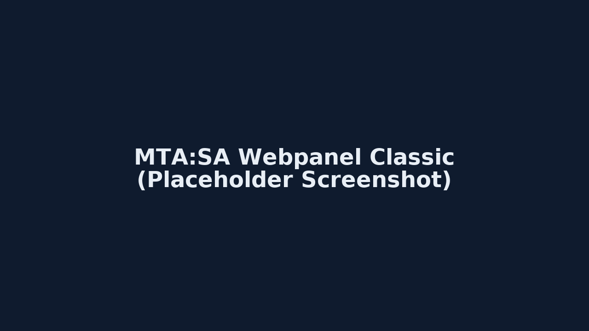

# MTA:SA Webpanel (Classic, 2008–2025)

Ein simples, einzelfiliges Webpanel für **MTA:SA** – Dark UI (schwarz/blau) mit **weißen Buttons**, 
inkl. Demo-Daten (localStorage) und optionaler Anbindung per HTTP-API.

- Tabs: **Übersicht** • **Fahrzeuge** (Kennzeichen) • **Finanzen** (Einnahmen/Ausgaben) • **Einstellungen**
- Demo-Modus: läuft komplett im Browser
- API-Modus: konfigurierbare Base URL + Owner/Spieler-ID

> © **2008–2025 THCBOB**  
> Open Source • Kostenlos für die Community

---

## Schnellstart
1. `index.html` herunterladen und lokal im Browser öffnen (Demo-Modus).
2. Für API-Modus in **Einstellungen**:
   - Modus: **API (HTTP)**
   - **API Base URL** setzen (z. B. `https://panel.dein-server.tld`)
   - **Owner/Spieler-ID** setzen (z. B. `steam:110000...`)

### Erwartete Endpoints (Beispiel)
- `GET  /api/ping` → `{ ok: true }`
- `GET  /api/overview?ownerId=<id>` → `{ playerName, cash, bank, assets, liabilities }`
- `GET  /api/vehicles?ownerId=<id>` → `[ { id, plate, model, color } ]`
- `POST /api/vehicles` (JSON) → `{ plate, model, color, ownerId }`
- `GET  /api/transactions?ownerId=<id>` → `[ { id, type, amount, category, note, ts } ]`
- `POST /api/transactions` (JSON) → `{ type, amount, category, note, ownerId }`

> **CORS:** Erlaubt die Origin der Webpanel-Domain am Server.

---

## Installation & Nutzung

### 1. Download
- Lade dir die aktuelle Version hier von GitHub herunter:  
  [➡️ Download ZIP](https://github.com/XdrBOBX/mta-webpanel/archive/refs/heads/main.zip)

- Entpacke die Dateien in einen Ordner deiner Wahl (z. B. `mta-webpanel/`).

### 2. Demo-Modus (einfacher Start)
1. Öffne die Datei **index.html** direkt im Browser (Doppelklick).
2. Das Webpanel startet mit **Demo-Daten** (gespeichert in deinem Browser-Cache).
3. Du kannst sofort:
   - Fahrzeuge hinzufügen
   - Einnahmen/Ausgaben buchen
   - Übersicht ansehen

👉 Perfekt, um das Panel erst einmal kennenzulernen.

### 3. API-Modus (echte Server-Anbindung)
Damit das Panel mit deinem **MTA:SA-Server** kommuniziert:

1. **Server vorbereiten:**
   - Stelle sicher, dass dein Server eine HTTP-API mit den Endpoints anbietet:
     - `GET /api/ping`
     - `GET /api/overview?ownerId=<id>`
     - `GET /api/vehicles?ownerId=<id>`
     - `POST /api/vehicles`
     - `GET /api/transactions?ownerId=<id>`
     - `POST /api/transactions`

   *(Eine Beispiel-Implementierung findest du im Ordner `server-example/` → `server.js`.)*

2. **CORS aktivieren:**  
   Damit Browser-Anfragen erlaubt sind, muss dein Server CORS freigeben:  
   ```js
   res.set("Access-Control-Allow-Origin", "*");


## Screenshot (Placeholder)


